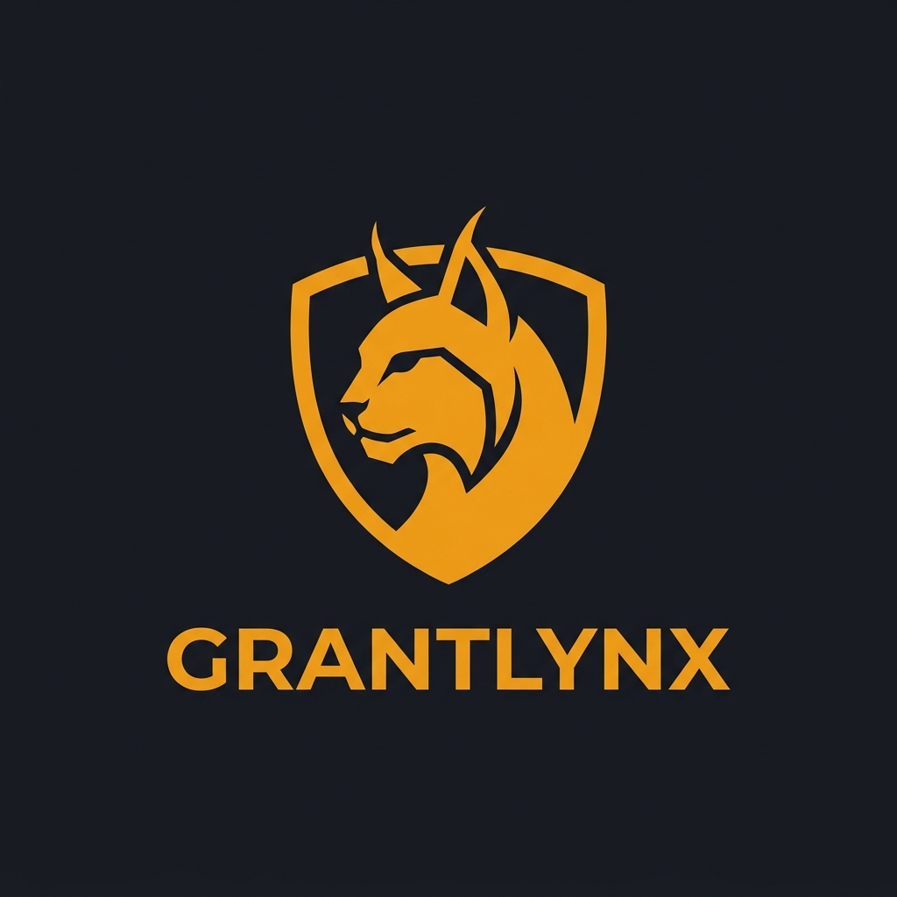
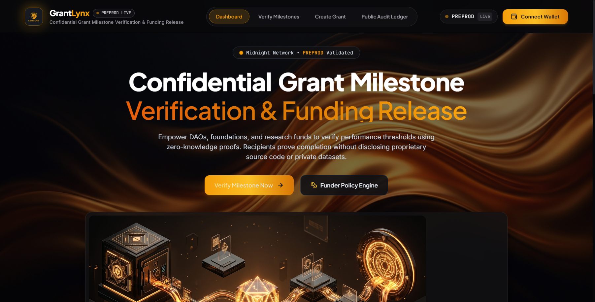
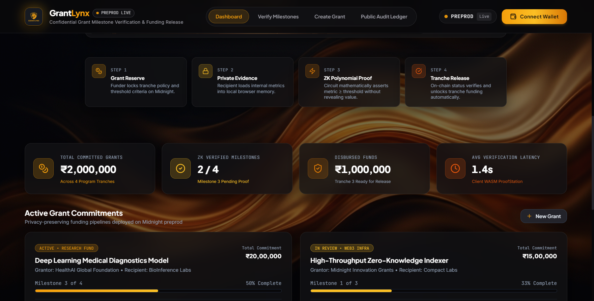
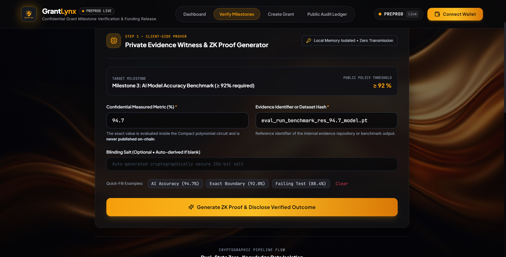
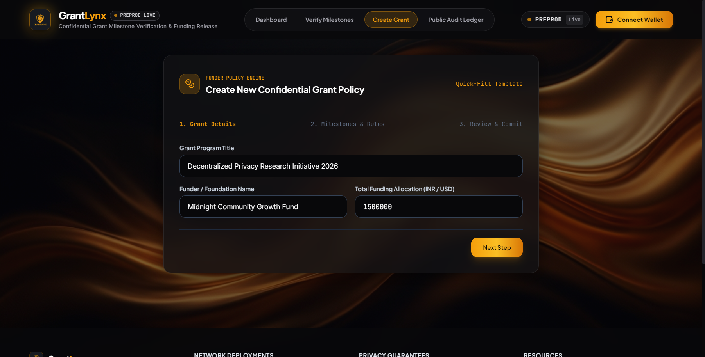
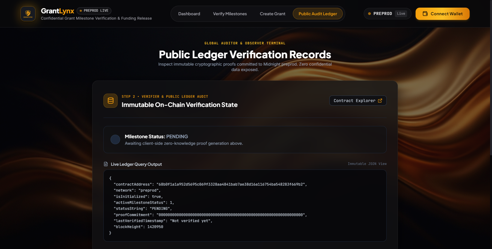

# GrantLynx — Confidential Grant Milestone Verification & Funding Release

<div align="center">
  
  
  <h3>Institutional Zero-Knowledge Milestone Verification Platform on Midnight Network</h3>

  <p>
    <strong>Empower DAOs, foundations, and research funds to verify performance thresholds using zero-knowledge proofs. Recipients prove milestone completion without publishing proprietary source code, confidential metrics, or private datasets.</strong>
  </p>

  <p>
    <a href="https://preprod.midnightexplorer.com/contracts/68b0f1a1a952d5695c069f3328aa4841bab7ae38d16a116754ba548283f669b2"></a>
    <a href="https://preprod.midnightexplorer.com/contracts/68b0f1a1a952d5695c069f3328aa4841bab7ae38d16a116754ba548283f669b2"></a>
    <a href="https://github.com/DavidHDev/react-bits"></a>
    
    
  </p>
</div>

---

<div align="center">
  
</div>

---

## 1. Executive Summary & Problem Solved

Traditional grant programs and institutional research sponsorships face a fundamental impasse:
- **Funders** (DAOs, innovation accelerators, government science bodies) require objective, measurable proof before disbursing capital tranches.
- **Recipients** (AI developers, biotech firms, cryptographic researchers) cannot disclose proprietary source code, internal test sets, or trade-secret model weights to satisfy reviewers.

Current systems rely on manual document reviews, centralized evidence handling, or fragile NDAs that leak over time.

### The GrantLynx Solution
**GrantLynx** resolves this tension by implementing an automated **Zero-Knowledge Milestone Verification Pipeline** on the Midnight Network:
1. **Funder sets an on-chain threshold:** e.g., *"Model Accuracy $\ge$ 92% on validation benchmark"*.
2. **Recipient proves compliance locally:** The recipient's machine runs a Compact polynomial circuit evaluating their confidential metric ($94.7\%$).
3. **Ledger records mathematical proof only:** The on-chain contract settles to `status = VERIFIED` with an immutable 32-byte commitment. The actual metric ($94.7\%$) and the private dataset **never leave client RAM**.
4. **Tranche release is unlocked:** Funds are safely authorized without compromising recipient IP.

---

## 2. Live On-Chain Deployments & Verified Transactions

GrantLynx is deployed and fully verified on the **Midnight Preprod Testnet**. All four core circuit operations have been executed and confirmed on-chain:

### Primary Contract State
- **Contract Address:** [`68b0f1a1a952d5695c069f3328aa4841bab7ae38d16a116754ba548283f669b2`](https://preprod.midnightexplorer.com/contracts/68b0f1a1a952d5695c069f3328aa4841bab7ae38d16a116754ba548283f669b2)
- **Deployer Wallet Address:** `mn_addr_preprod170a8t0cndggvvdx0x4c69s2fddavxggrw33e40jh6406ykg7sessmcp5dm`
- **Network:** Midnight Preprod (`wss://rpc.preprod.midnight.network`)

### Confirmed On-Chain Transactions

| Operation | Circuit Call | Transaction Hash (Plural REST Endpoint) | Block Hash | Status |
|:---|:---|:---|:---|:---:|
| **1. Deploy Contract** | Contract Genesis | [`002b54d195170168d567db00e9db675b4020cbcb1fd31b9b10ab5972446663a630`](https://preprod.midnightexplorer.com/transactions/002b54d195170168d567db00e9db675b4020cbcb1fd31b9b10ab5972446663a630) | `0xdec7c3dbb32e64a48a33f358bb219d71d26460f75589f53df95907bb874576d7` | **Confirmed** |
| **2. Initialize Policy** | `initializeGrant` | [`135741e2d815353c9681cc4ebe3c1d66611e24babfffd859ccf2b48b727a9f5a`](https://preprod.midnightexplorer.com/transactions/135741e2d815353c9681cc4ebe3c1d66611e24babfffd859ccf2b48b727a9f5a) | `0x43140a6c9182efb978bc68bc8c35847ae383ba69adfabcba7facc111fc055272` | **Confirmed** |
| **3. Configure Milestone** | `configureMilestone` | [`e9060c9f51bfd1dbf63e5a4787d837a77e6dc63cc617d6e04783f9057a998849`](https://preprod.midnightexplorer.com/transactions/e9060c9f51bfd1dbf63e5a4787d837a77e6dc63cc617d6e04783f9057a998849) | `0x336519393d34243a8bd582ab0fb006bdc2f0b835b4907dacf575f3dc47d4f312` | **Confirmed** |
| **4. Zero-Knowledge Proof** | `verifyMilestoneZK` | [`e1e2660b87531c6390b674bef77c72472e109370d52947ee81d31a9470205979`](https://preprod.midnightexplorer.com/transactions/e1e2660b87531c6390b674bef77c72472e109370d52947ee81d31a9470205979) | `0xc9a3485b312706d46a350812419dc48fa474dea88ee5043b03d32f7b69de10e1` | **Confirmed** |

*Note: All explorer links adhere strictly to Midnight's plural URL specifications (`/contracts/[address]` and `/transactions/[txHash]`).*

---

## 3. Visual Interface & User Experience Gallery

GrantLynx features an institutional Obsidian Charcoal (`#08080a`) & Radiant Amber/Gold (`#f59e0b`, `#fbbf24`) design palette, utilizing micro-interactions and motion primitives from [React Bits](https://reactbits.dev).

### 1. Dashboard & Hero Overview
*Featuring real-time Preprod network validation badge, 3D funding pipeline artwork, and dynamic metric counters.*


### 2. Active Grant Commitments & On-Chain Audit Feed
*Multi-tranche grant tracking with progress indicators and live Substrate block-feed telemetry.*


### 3. Zero-Knowledge Client Proving Station
*Client-isolated witness intake with quick-fill edge-case testers and animated polynomial proving state.*


### 4. Funder Grant Policy Builder
*Multi-step stepper workflow to define milestone predicates, threshold targets, and tranche capital allocations.*


### 5. Public Audit Ledger & Verifier Terminal
*Real-time JSON ledger query terminal and immutable 32-byte cryptographic proof commitment inspection.*


---

## 4. High-Level Architectural Pipeline

```
 ┌─────────────┐       ┌─────────────────┐       ┌───────────────────────┐       ┌──────────────────┐
 │ Step 1:     │       │ Step 2:         │       │ Step 3:               │       │ Step 4:          │
 │ Grant       │ ────> │ Private Metric  │ ────> │ Compact ZK Circuit    │ ────> │ Tranche          │
 │ Allocation  │       │ Witness Intake  │       │ Mathematical Proof    │       │ Disbursement     │
 └─────────────┘       └─────────────────┘       └───────────────────────┘       └──────────────────┘
  Funder sets           Recipient loads           Proves: metric >= threshold     Funder confirms via
  policy hash &         internal metric           Discloses ONLY boolean          1.8s HoldButton to
  tranches on chain     into client RAM           result & proof commitment       release capital
```

### Unidirectional Spatial Flow
- **Top Section (Client Prover):** Clean, unpolluted inputs with faded prompts and optional quick-fill chips for rapid edge-case testing. Client-side memory isolation guaranteed.
- **Middle Section (ZK Pipeline Animation):** Visualizes the real-time transformation from private witness to disclosed SNARK assertion.
- **Bottom Section (Verifier & Ledger Audit):** Live on-chain status inspection, raw JSON terminal, and deep links to midnightexplorer.com.

---

## 5. Dual-State Privacy Model & Gas Economics

### Ledger State vs. Private Witnesses

| State Variable | Type | Visibility | Purpose |
|:---|:---:|:---:|:---|
| `grantPolicyCommitment` | Public Ledger | Visible to all | Mutually agreed policy hash ($H(\text{policy})$) |
| `activeMilestoneStatus` | Public Ledger | Visible to all | Status code: `0=Unset, 1=Pending, 2=Verified, 3=Disputed, 4=Released` |
| `activeThreshold` | Public Ledger | Visible to all | Public criterion (e.g. `92%`) |
| `activeProofCommitment` | Public Ledger | Visible to all | 32-byte `persistentHash` binding proof to milestone |
| `isTrancheReleasable` | Public Ledger | Visible to all | Release authorization boolean flag |
| `privateMetric` | **Private Witness** | **Hidden** | Measured metric value (never leaves browser RAM) |
| `evidenceHash` | **Private Witness** | **Hidden** | Raw evaluation dataset or binary artifact hash |
| `privateSalt` | **Private Witness** | **Hidden** | 256-bit blinding salt preventing rainbow table reversal |

### Dual-Token Gas Economics (DUST + tNIGHT)
Midnight uses a dual-token resource model:
- **tNIGHT:** Native unshielded governance and value-bearing asset used for funding accounts and generating DUST.
- **DUST:** Non-transferable computational resource unit (denominated in Specks, $10^{16}$) consumed to shield transaction graph state and pay consensus block inclusion fees.
- **Gas Management:** GrantLynx's automated wallet synchronization actively monitors DUST generation UTXOs and guarantees spent UTXO reconciliation before generating ZK proofs.

---

## 6. React Bits Motion System Integration

GrantLynx eliminates traditional blue/green tropes in favor of an institutional Obsidian Charcoal & Radiant Gold identity powered by [React Bits](https://reactbits.dev):

- **Typography & Disclosures:**
  - `SplitText`: Staggered character entrance on primary headlines.
  - `BlurText`: Blur-to-sharp animation for institutional mission context.
  - `GradientText`: Molten amber-to-gold shimmer on key value propositions.
  - `DecryptedText`: Cipher matrix decrypting live 32-byte SHA-256 proof commitments.
  - `CountUp`: Smooth tabular-num counters for fund commitments and verification latencies.
  - `ShinyText`: Radiant golden reflection across the primary verification action.
- **Micro-Interactions & Safety Controls:**
  - `HoldButton`: 1.8-second press-and-hold with liquid amber progress fill to prevent accidental tranche fund release.
  - `ClickSpark`: Golden particle emission upon triggering client-side ZK proof calculations.
  - `SpringCheck`: Physics-based responsive checkmark on confirmed milestone states.
  - `TiltedCard`: Specular lighting and 3D parallax on grant portfolio cards.
  - `PillNav`: Tactile tab navigation dock.

---

## 7. Quickstart & Local Development

### Prerequisites
- **Node.js:** v22.x or higher
- **Compact Compiler:** `compact 0.5.2`
- **Docker Desktop:** Running locally for the Midnight proof server (`midnight-proof-server`)

### 1. Repository Setup
```bash
# Clone the repository
git clone https://github.com/your-org/grantlynx.git
cd grantlynx

# Install dependencies
npm install
```

### 2. Compile Compact Circuits
```bash
# Compiles contract/src/grantlynx.compact into ZK circuits and TypeScript bindings
npm run compile:contract
```

### 3. Run Headless Simulation Tests
```bash
# Executes 11 comprehensive Vitest simulation tests
npm run test:contract
```

```
 RUN  v2.1.9 contract/

 ✓ test/grantlynx.test.ts (11 tests) 431ms
   ✓ 1. successfully initializes grant with policy commitment and funder identity
   ✓ 2. prevents re-initialization exploits with strict assertion check
   ✓ 3. configures active milestone condition and tranche funding
   ✓ 4. rejects configuring milestone ID exceeding declared total
   ✓ 5. proves private metric satisfies threshold and unlocks tranche release
   ✓ 6. succeeds at exact threshold boundary condition (boundary test)
   ✓ 7. throws assertion failure when private metric is strictly below threshold
   ✓ 8. rejects verifying milestone when milestone is not in PENDING status
   ✓ 9. opens dispute window on verified milestone, disabling tranche release
   ✓ 10. rejects dispute opening on an unverified milestone
   ✓ 11. verifies zero private witness leakage to on-chain ledger state

 Test Files  1 passed (1)
      Tests  11 passed (11)
```

### 4. Launch Development / Preview Frontend
```bash
# Build production bundle
npm run build --prefix frontend

# Preview production build locally
npm run preview --prefix frontend -- --port 5173
```

---

## 8. Continuous Integration & Deployment (CI/CD)

The repository includes a production-grade `.github/workflows/ci.yml` pipeline that triggers on all pull requests:
1. **Contract Compilation & Verification:** Compiles `grantlynx.compact` and validates circuit constraints.
2. **Simulation Test Suite:** Executes all 11 Vitest assertions.
3. **Frontend Typecheck & Build:** Runs `tsc --noEmit` and bundles optimized Vite assets.
4. **Artifact Archiving:** Packages and signs verified build outputs.

---

## 9. License

GrantLynx is open-source software released under the **Apache License 2.0**.
